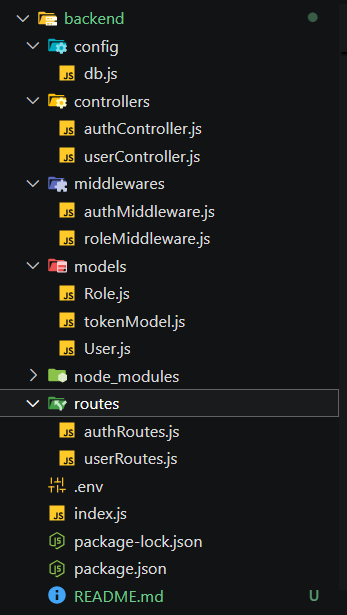

# **Project Title: AuthShield: A Secure Role-Based Access Control System**  


# Role-Based Access Control (RBAC) System for VRV Security

## 1. Introduction

This project implements a secure **Role-Based Access Control (RBAC)** system for authentication and authorization, aligning with VRV Security’s commitment to building robust cybersecurity solutions. RBAC ensures that access to resources is granted based on user roles, minimizing the risks associated with unauthorized access.

The system includes features like:
- User registration and login
- Secure token-based session management
- Role-based access restrictions  

By employing best practices, this project demonstrates a comprehensive understanding of authentication, authorization, and RBAC principles, vital for secure and scalable backend systems.

---

## 2. Objectives

The primary objectives of the project are:

1. **Authentication**: Build a secure mechanism to validate users and grant access through JWT tokens.
2. **Authorization**: Ensure users can only access resources or perform actions allowed by their roles.
3. **Role-Based Access Control**: Design a system where roles (e.g., Admin, HOD, and Student) dictate permissions, ensuring fine-grained control.
4. **Secure Implementation**: Follow security best practices, including password hashing, token expiration, and structured API responses.

### User Roles & Hierarchy:
- **Admin**: Manages HODs and oversees the system.
- **HOD (Head of Department)**: Manages students within their department.
- **Student**: Can access personal profile information.

---

## 3. Implementation

### 3.1 Technologies Used:
- **Backend Framework**: Node.js with Express.js
- **Database**: MongoDB Atlas with Mongoose for schema modeling
- **Authentication**: JSON Web Tokens (JWT) for session management
- **Encryption**: Password hashing with `bcryptjs`

### 3.2 Key Features:
1. **User Registration**:
   - Allows users to register with attributes like username, email, password, role, and department.
   - Validates unique email addresses.
2. **User Login**:
   - Authenticates user credentials and generates a secure JWT token upon successful login.
3. **Role-Based Access Control (RBAC)**:
   - Middleware to restrict access based on user roles.
   - Example: Admins can view HOD details and their department's students, while HODs can only view students in their department.
4. **Secure Password Storage**:
   - Passwords are hashed using `bcrypt` for secure database storage.
5. **Token-Based Authentication**:
   - JWT tokens are issued upon login and verified during subsequent API requests.

---

## 4. Project Structure


## Description of Each Folder/File

- **controllers/**: Contains logic to handle requests, including authentication and user data management.
- **middleware/**: Custom middleware for verifying JWT tokens and enforcing role-based access.
- **models/**: Defines the schema for the `User` model with roles and permissions.
- **routes/**: API routes for authentication and user profile management.
- **config/**: Configuration files, such as the database connection setup.
- **.env**: Environment variables used for sensitive data like API keys and database URIs.
- **server.js**: The main entry point where the server is initialized.
- **package.json**: The file that contains project dependencies and metadata.




---

## 5. API Documentation

### Authentication APIs

| Endpoint             | HTTP Method | Description                                              | Access               |
|-----------------------|-------------|----------------------------------------------------------|----------------------|
| `/api/auth/register` | POST        | Registers a new user. Requires username, email, password, role, and department. | Public               |
| `/api/auth/login`    | POST        | Logs in a user with email and password. Returns a JWT token. | Public               |
| `/api/auth/logout`   | POST        | Logs out a user.                                         | Authenticated Users  |

### User APIs

| Endpoint                  | HTTP Method | Description                                                    | Access               |
|---------------------------|-------------|----------------------------------------------------------------|----------------------|
| `/api/users/profile`      | GET         | Retrieves the logged-in user's profile data.                  | Authenticated Users  |
| `/api/users/hod/students` | GET         | Retrieves students for HODs based on department.              | HOD                  |
| `/api/users/admin`        | GET         | Retrieves HOD details and respective department students.     | Admin                |

---

## 6. Middleware Functions

1. **`authMiddleware.js`**:
   - Ensures a valid JWT token is included in the `Authorization` header for secure API access.
2. **`roleMiddleware.js`**:
   - Restricts access to specific roles, e.g., only Admins can view HOD details.

---

## 7. Sample API Workflow

### 7.1 User Registration (Admin/HOD/Student)
**Request**:  
```http
POST /api/auth/register
Content-Type: application/json
{
    "username": "dilesh",
    "email": "dilesh@gmail.com",
    "password": "123456",
    "role": "Student",
    "department": "CSE"
}
```
```http
**Response**:

{
    "message": "User registered successfully"
}
```

### 7.2 User Login
**Request**:  
```http
POST /api/auth/login
Content-Type: application/json
{
    "email": "admin@gmail.com",
    "password": "admin"
}
```


**Response**:
```http

{
    "message": "User registered successfully"
}
```

### 7.3  Access User Profile
**Request**:  
```http
GET /api/users/profile
Authorization: Bearer jwt-token

```


**Response**:
```http
{
  "user": {
    "id": "123456",
    "username": "JohnDoe",
    "email": "john@example.com",
    "role": "Student",
    "department": "CSE"
  }
}

```

### 7.4 View Admin Panel
**Request**:  
```http
GET /api/users/admin
Authorization: Bearer jwt-token

```


**Response**:
```http

{
    "user": {
        "_id": "67449a9279ff6b79d355478e",
        "username": "admin",
        "email": "admin@gmail.com",
        "role": "Admin",
        "department": null,
        "__v": 0
    },
    "hods": [
        {
            "hod": {
                "_id": "67449a6f79ff6b79d355478a",
                "username": "Rekha",
                "email": "rekha@gmail.com",
                "password": "$2a$10$M7DVKc3CGEcKuhGT5mfT5eSxhjOMs2aXmEzIbrmIcliiNUag86ZQ6",
                "role": "HOD",
                "department": "CSE",
                "__v": 0
            },
            "students": [
                {
                    "_id": "67449a4579ff6b79d3554783",
                    "username": "ram",
                    "email": "ram@gmail.com",
                    "role": "Student",
                    "department": "CSE",
                    "__v": 0
                },
                {
                    "_id": "67449f2dadaa48da8453e699",
                    "username": "sanjay",
                    "email": "sanjay@gmail.com",
                    "role": "Student",
                    "department": "CSE",
                    "__v": 0
                },
                {
                    "_id": "674547139d8d2423b31df2df",
                    "username": "dilesh",
                    "email": "dilesh@gmail.com",
                    "role": "Student",
                    "department": "CSE",
                    "__v": 0
                }
            ]
        }
    ]
}
```
### 7.5 View HOD Panel
**Request**:  
```http
GET /api/users/hod/students
Authorization: Bearer jwt-token


```


**Response**:
```http

{
    "user": {
        "_id": "67449a6f79ff6b79d355478a",
        "username": "Rekha",
        "email": "rekha@gmail.com",
        "role": "HOD",
        "department": "CSE",
        "__v": 0
    },
    "students": [
        {
            "_id": "67449a4579ff6b79d3554783",
            "username": "ram",
            "email": "ram@gmail.com",
            "role": "Student",
            "department": "CSE",
            "__v": 0
        },
        {
            "_id": "67449f2dadaa48da8453e699",
            "username": "sanjay",
            "email": "sanjay@gmail.com",
            "role": "Student",
            "department": "CSE",
            "__v": 0
        },
        {
            "_id": "674547139d8d2423b31df2df",
            "username": "dilesh",
            "email": "dilesh@gmail.com",
            "role": "Student",
            "department": "CSE",
            "__v": 0
        }
    ]
}
```
## 7. Security Features

1. **Password Hashing**: Ensures passwords are stored securely using `bcrypt`.
2. **JWT Authentication**: Provides stateless, secure session management with token expiration.
3. **Role-Based Middleware**: Enforces granular access control for APIs.

---

## 8. Conclusion

This project demonstrates a practical implementation of **Role-Based Access Control (RBAC)** using **Node.js**, **Express.js**, and **MongoDB**. By adhering to security best practices and creating role-specific access, this system ensures secure and efficient user management.  

The modular architecture allows easy scalability and integration into larger systems, making it a robust solution for VRV Security's requirements.

[To know more click here](https://firebasestorage.googleapis.com/v0/b/expense-tracker-app-by-ram.appspot.com/o/README.pdf?alt=media&token=abde00a1-87f8-4f97-be05-a435a8bb2c47)


